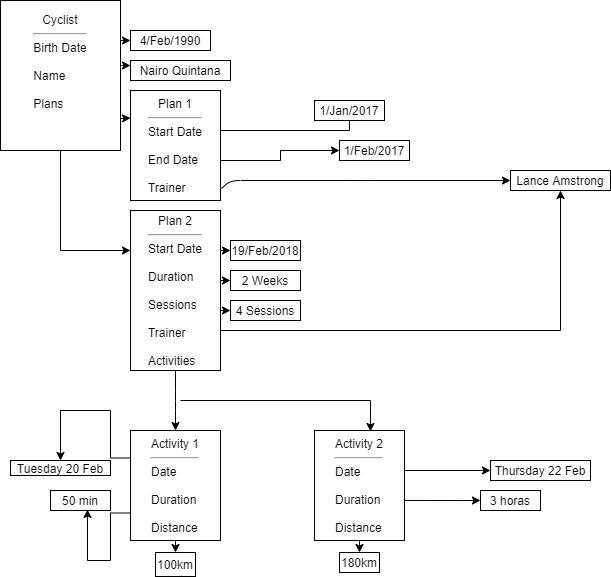
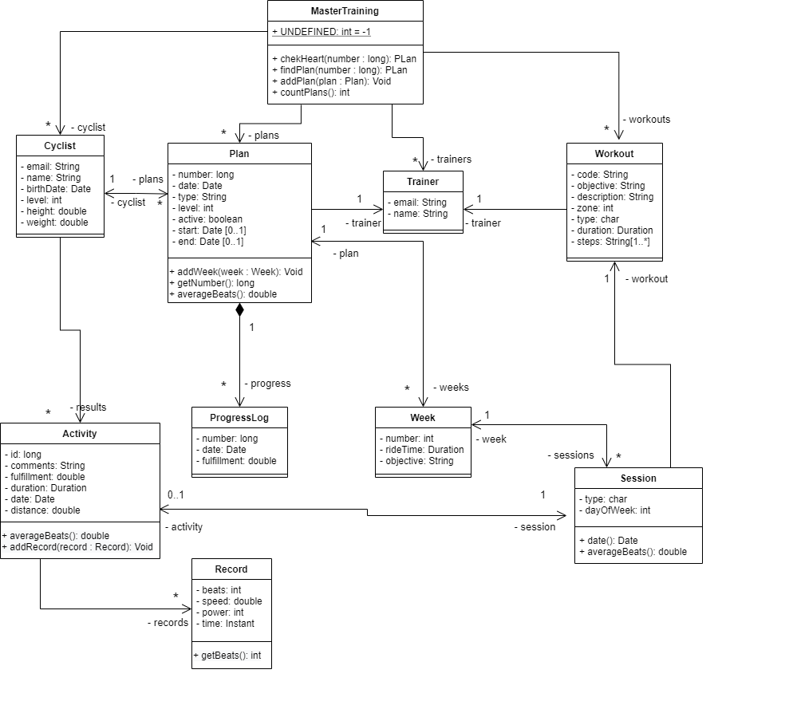
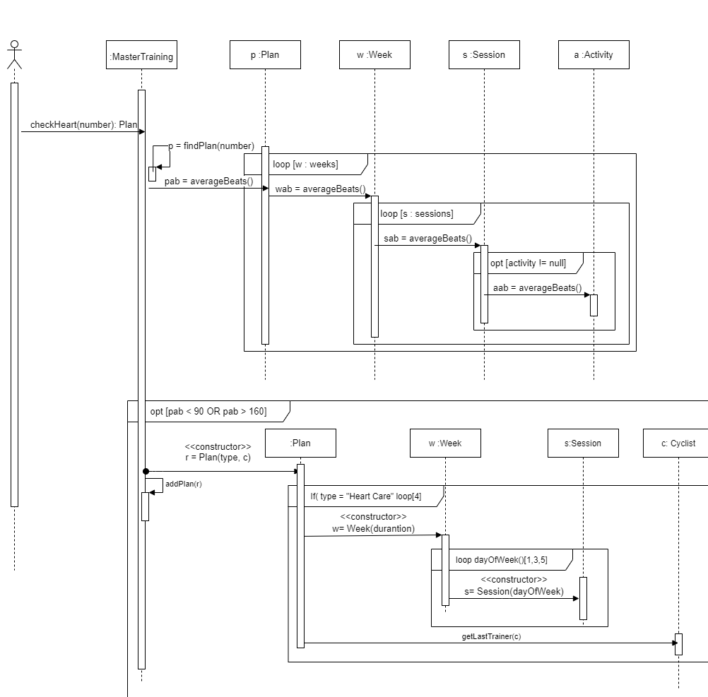

 # Pre Parcial Primer corte POOB

 ## Diagrma de Memoria

 

 ## Diagrma UML

 

 ## Diagrma de Secuencia

 

 ## Conceptos

 ¿Qué es la sobrecarga de métodos?, ¿Cuándo es útil o apropiado realizar una sobrecarga de un método y cuáles son sus beneficios?

 LA sobrecarga de metodos es cuando se crean varios metodos con el mismo nombre pero con parametro diferente como ejemplo;

 public int suma (int a, int b){}

 public double suma (double a, double b, double z){}

Los beneficos que tiene la sobrecarga de metodos es que es muy flexible, por ejemplo es bastante util con el ejemplo anterion en donde se puede usar el mismo metodo de nombre suma para relaizar la misma operación matematica pero para tipo de variables diferentes como enteros y decimales.  

 ¿Cuáles son las 5 etapas del proceso de desarrollo de software vistas en clase? ¿Cuál es el propósito de cada una de ellas?

 ### 1. Análisis
 Se analisa el problema plantedo, se determinan los requisistos, las variables y los objetos, basicamente los requerimientos del sistema

 ### 2. Diseño
 Se realiza un diseño para plantear la solucion del problema diseñando cada una de sus funciones para esto se utiliza el diagrama de memoria, UML y secuencia

 ### 3. Programación e Implementación
 Basados en los Diagrams diseñados se empiza a programar y a implementar la solución

 ### 4. Pruebas
 Se realizan las pruebas correpondiente para validar cada una de las funciones del programa

 ### 5. Documentación
 Se docuemnta los caracteristicas de cada clase y sus metodos, con el fin de explicar la funciín de cada una de ellas.
